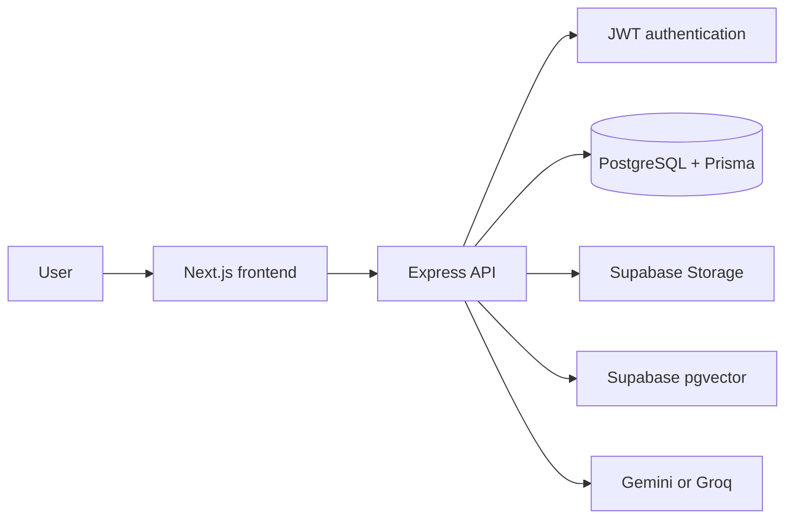
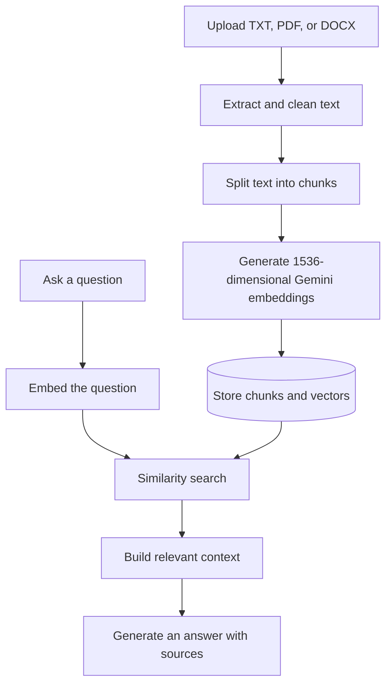

# QueryDocs

### Ask questions. Find answers in your documents.

QueryDocs is a full-stack document question-answering application built around retrieval-augmented generation (RAG). Users can upload documents, select the documents they want to search, ask questions in a conversation, and receive AI-generated answers with relevant sources.

## Overview

QueryDocs is split into two applications:

- **Frontend**: Next.js interface for authentication, document management, chat, conversation history, profile, and settings.
- **Backend**: TypeScript and Express API for authentication, document processing, embeddings, vector search, answer generation, persistence, and Supabase Storage.

The backend uses PostgreSQL through Prisma for application data. Supabase provides private document storage and pgvector-based similarity search. Gemini provides document embeddings and the default answer-generation provider; Groq is also supported for answer generation.

## Architecture



### RAG workflow



## Architecture diagrams

| Diagram | Description |
| --- | --- |
| [System architecture](architecture/SYSTEM_ARCHITECTURE.png) | Application components and external services |
| [RAG pipeline](architecture/RAG_PIPELINE.png) | Document ingestion and question-answering flow |
| [Database architecture](architecture/DATABASE_ARCHITECTURE.png) | PostgreSQL entities and relationships |

## Features

- Account registration, login, and protected dashboard routes
- Upload and process TXT, PDF, and DOCX documents
- Semantic document search with vector embeddings
- AI-generated answers grounded in selected document content
- Source references returned with answers
- Conversation creation, history, renaming, and deletion
- Dashboard statistics for documents, questions, and storage
- Temporary local uploads with original files stored in private Supabase Storage
- Structured backend logging and validated environment configuration

## Repository structure

```text
.
├── architecture/       System, RAG, and database diagrams
├── backend/             Express API, Prisma schema, processing pipeline, and tests
├── frontend/            Next.js application and UI components
└── README.md            Project overview and navigation
```

## Getting started

### Prerequisites

- Node.js 20 or later
- Docker Desktop, or an existing PostgreSQL database
- A Supabase project with Storage and database access
- A Gemini API key

### 1. Start the backend

Follow the complete setup guide in [backend/README.md](backend/README.md). In brief:

```bash
cd backend
npm install
docker compose up -d postgres
npm run db:generate
npm run db:push
npm run dev
```

The backend runs at `http://localhost:8080` by default. The backend README explains the required `.env` values and the one-time Supabase vector SQL setup.

### 2. Start the frontend

In a second terminal, follow [frontend/README.md](frontend/README.md):

```bash
cd frontend
npm install
npm run dev
```

The frontend runs at `http://localhost:3000` and uses `http://localhost:8080` as the default API URL. To use another backend URL, create `frontend/.env` with:

```env
NEXT_PUBLIC_API_URL=http://localhost:8080
```

The backend `CLIENT_ORIGIN` must match the frontend URL for browser requests to succeed.

## Development commands

Run commands from the relevant application directory.

| Area | Install | Development | Validation | Production |
| --- | --- | --- | --- | --- |
| Backend | `npm install` | `npm run dev` | `npm run typecheck` and `npm test` | `npm run build && npm start` |
| Frontend | `npm install` | `npm run dev` | `npm run lint` | `npm run build && npm start` |

## API and application documentation

- [Backend setup, environment, API routes, and database](backend/README.md)
- [Frontend setup, routes, API integration, and project structure](frontend/README.md)
- [System architecture diagram](architecture/SYSTEM_ARCHITECTURE.png)
- [RAG pipeline diagram](architecture/RAG_PIPELINE.png)
- [Database architecture diagram](architecture/DATABASE_ARCHITECTURE.png)

## Security notes

- Keep backend `.env` files and API credentials out of version control.
- Never expose `SUPABASE_SERVICE_ROLE_KEY`, database credentials, or model API keys to the frontend.
- Use a strong, unique `JWT_SECRET` in production.
- Restrict the backend CORS origin to the deployed frontend URL.
- Keep the Supabase document bucket private.


## Project context

QueryDocs is a learning project created to practice full-stack application development, RAG workflows, document processing, authentication, vector search, and AI integration. AI assistant agents were used during development for selected tasks, repetitive tasks, learning, exploration, implementation support, and documentation.

## Educational Purpose

QueryDocs is primarily an educational and learning project.
It may contain bugs, incomplete implementations, or dependencies
on third-party services.

Users are solely responsible for reviewing, modifying, and deploying this project.

## AI-Assisted Development

This project was developed with the assistance of AI coding tools
and agents for code generation, debugging, refactoring,
documentation, and development support.